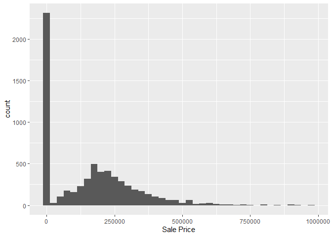
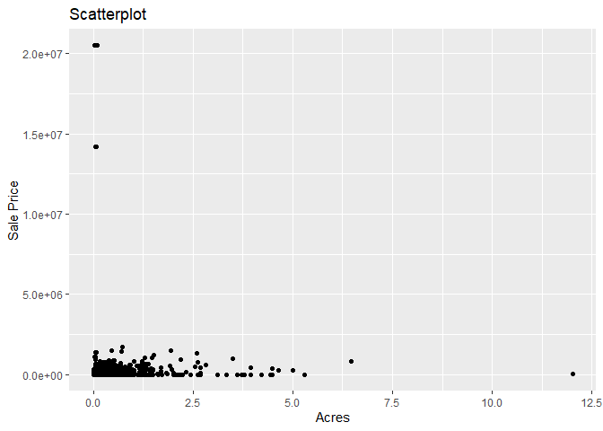

<!-- README.md is generated from README.Rmd. Please edit the README.Rmd file -->

# Lab report \#1

Follow the instructions posted at
<https://ds202-at-isu.github.io/labs.html> for the lab assignment. The
work is meant to be finished during the lab time, but you have time
until Monday evening to polish things.

Include your answers in this document (Rmd file). Make sure that it
knits properly (into the md file). Upload both the Rmd and the md file
to your repository.

## Variables (#1)

Variables include

- Parcel Id is a chr of id
- Address chr of address
- Style is a character fctr which is style of house
- Occupancy is a character fctr of occupancy
- Sale Date is a date of when sold
- Sale Price is a dbl of sale price
- Multi Sale chr of if sold multi or not
- Year Built int of when built
- Acres dbl of acre amount
- Total living Area int of total living area
- Bedrooms int of how many bedrooms
- FinishedBsmtAre is a dbl of total area of finished basement
- LotArea dbl of lot area in sq feet
- AC is logical value of if propertyh has ac
- FirePlace logical value of if has fire place
- Neighborhood factor variable of neighborhood area in ames All
  submissions to the github repo will be automatically uploaded for
  grading once the due date is passed. Submit a link to your repository
  on Canvas (only one submission per team) to signal to the instructors
  that you are done with your submission.

=======

## Variable of Main Interest (#2)

We think that the variable of particular interest is probably the sale
price. You can compare sale price to every other variable and try to
find out why it is lower or higher.

## Exploration of Main Variable (#3)

The Main variable is the sale price.

``` r
library(classdata)
library(ggplot2)
summary(ames$`Sale Price`)
```

    ##     Min.  1st Qu.   Median     Mean  3rd Qu.     Max. 
    ##        0        0   170900  1017479   280000 20500000

``` r
ggplot(ames, aes(x = `Sale Price`)) +
  geom_histogram(bins = 40)
```

<!-- --> The range of
sale price is from \$0 to \$20,500,000. The median sale price is
\$170,900.

After Filtering for houses over 1,000,000 this is the filtered chart:

``` r
ames_filtered <- ames[ames$`Sale Price` < 1000000, ]

ggplot(ames_filtered, aes(x = `Sale Price`)) +
  geom_histogram(bins = 40)
```

<!-- -->

As a team we said generally most houses are under \$500,000, there
appears to be a somewhat normal distribution centered around ~\$240,000.
The sale price is right skewed.There are significant outliers that
affect the data.

Isabel’s Work:

``` r
library(ggplot2)
ggplot(ames, aes(x = Acres, y = `Sale Price`)) +
  geom_point() +
  labs(title = "Scatterplot")
```

    ## Warning: Removed 89 rows containing missing values or values outside the scale range
    ## (`geom_point()`).

<!-- -->

- Most of the distribution in the scatterplot accross the x axis is
  between 0.0 and 2.5 acres. Although there are outlier oddities. If I
  were to take out outliers with high sales price or high acres, our
  dataset would be more clear to read. When observing the outliers,
  there isn’t a correlation between price and acres. The acres with the
  highest count aren’t high in price and vice versa for price. This
  leads me to believe that other variables are impacting this data.
