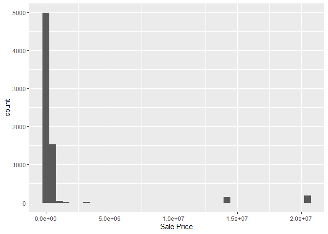

<!-- README.md is generated from README.Rmd. Please edit the README.Rmd file -->

# Lab report \#1

Follow the instructions posted at
<https://ds202-at-isu.github.io/labs.html> for the lab assignment. The
work is meant to be finished during the lab time, but you have time
until Monday evening to polish things.

Include your answers in this document (Rmd file). Make sure that it
knits properly (into the md file). Upload both the Rmd and the md file
to your repository.

## Variables (#1)

Variables include - Parcel Id is a chr of id - Address chr of address -
Style is a character fctr which is style of house - Occupancy is a
character fctr of occupancy - Sale Date is a date of when sold - Sale
Price is a dbl of sale price - Multi Sale chr of if sold multi or not -
Year Built int of when built - Acres dbl of acre amount - Total living
Area int of total living area - Bedrooms int of how many bedrooms -
FinishedBsmtAre is a dbl of total area of finished basement - LotArea
dbl of lot area in sq feet - AC is logical value of if propertyh has
ac - FirePlace logical value of if has fire place - Neighborhood factor
variable of neighborhood area in ames All submissions to the github repo
will be automatically uploaded for grading once the due date is passed.
Submit a link to your repository on Canvas (only one submission per
team) to signal to the instructors that you are done with your
submission.

Isabel’s Work:

``` r
library(ggplot2)
ggplot(ames, aes(x = Acres, y = `Sale Price`)) +
  geom_point() +
  labs(title = "Scatterplot")
```

    ## Warning: Removed 89 rows containing missing values or values outside the scale range
    ## (`geom_point()`).

<!-- -->

- Most of the distribution in the scatterplot accross the x axis is
  between 0.0 and 2.5 acres. Although there are outlier oddities. If I
  were to take out outliers with high sales price or high acres, our
  dataset would be more clear to read.
