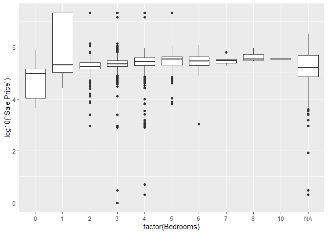
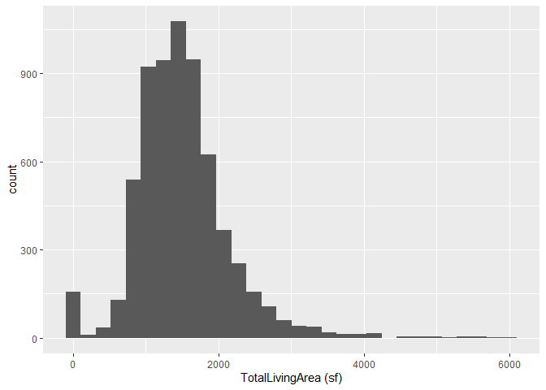
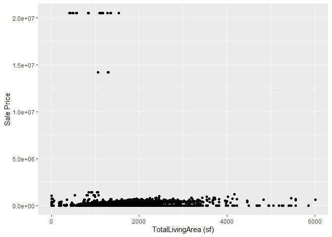
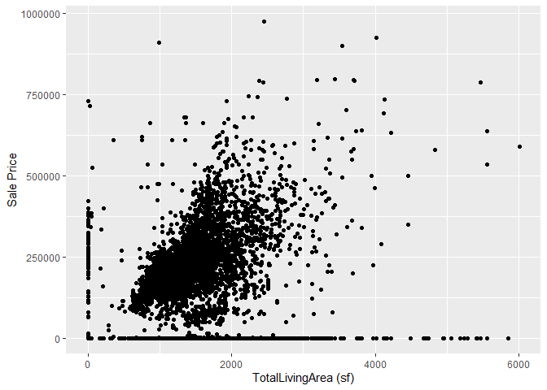
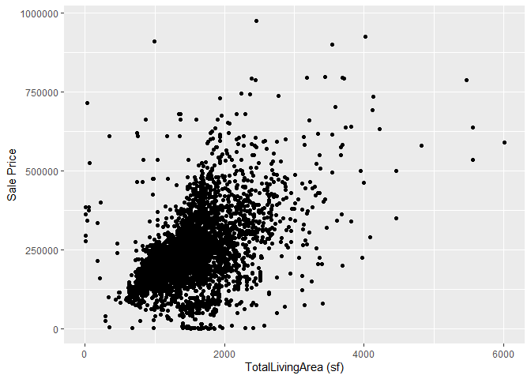

<!-- README.md is generated from README.Rmd. Please edit the README.Rmd file -->

# Lab report \#1

Follow the instructions posted at
<https://ds202-at-isu.github.io/labs.html> for the lab assignment. The
work is meant to be finished during the lab time, but you have time
until Monday evening to polish things.

Include your answers in this document (Rmd file). Make sure that it
knits properly (into the md file). Upload both the Rmd and the md file
to your repository.

## Variables (#1)

Variables include

- Parcel Id is a chr of id
- Address chr of address
- Style is a character fctr which is style of house
- Occupancy is a character fctr of occupancy
- Sale Date is a date of when sold
- Sale Price is a dbl of sale price
- Multi Sale chr of if sold multi or not
- Year Built int of when built
- Acres dbl of acre amount
- Total living Area int of total living area
- Bedrooms int of how many bedrooms
- FinishedBsmtAre is a dbl of total area of finished basement
- LotArea dbl of lot area in sq feet
- AC is logical value of if propertyh has ac
- FirePlace logical value of if has fire place
- Neighborhood factor variable of neighborhood area in ames
- Parcel Id is a chr of id
- Address chr of address
- Style is a character fctr which is style of house
- Occupancy is a character fctr of occupancy
- Sale Date is a date of when sold
- Sale Price is a dbl of sale price
- Multi Sale chr of if sold multi or not
- Year Built int of when built
- Acres dbl of acre amount
- Total living Area int of total living area
- Bedrooms int of how many bedrooms
- FinishedBsmtAre is a dbl of total area of finished basement
- LotArea dbl of lot area in sq feet
- AC is logical value of if propertyh has ac
- FirePlace logical value of if has fire place
- Neighborhood factor variable of neighborhood area in ames

## Variable of Main Interest (#2)

We think that the variable of particular interest is probably the sale
price. You can compare sale price to every other variable and try to
find out why it is lower or higher.

## Exploration of Main Variable (#3)

The Main variable is the sale price.

``` r
library(classdata)
library(ggplot2)
summary(ames$`Sale Price`)
```

    ##     Min.  1st Qu.   Median     Mean  3rd Qu.     Max. 
    ##        0        0   170900  1017479   280000 20500000

``` r
ggplot(ames, aes(x = `Sale Price`)) +
  geom_histogram(bins = 40)
```

<!-- --> The range of
sale price is from \$0 to \$20,500,000. The median sale price is
\$170,900.

After Filtering for houses over 1,000,000 this is the filtered chart:

``` r
ames_filtered <- ames[ames$`Sale Price` < 1000000, ]

ggplot(ames_filtered, aes(x = `Sale Price`)) +
  geom_histogram(bins = 40)
```

<!-- -->

As a team we said generally most houses are under \$500,000, there
appears to be a somewhat normal distribution centered around ~\$240,000.
The sale price is right skewed.There are significant outliers that
affect the data.

## Number 4:

# Isabel’s Work:

``` r
library(ggplot2)
ggplot(ames, aes(x = Acres, y = `Sale Price`)) +
  geom_point() +
  labs(title = "Scatterplot")
```

    ## Warning: Removed 89 rows containing missing values or values outside the scale range
    ## (`geom_point()`).

<!-- -->

- Most of the distribution in the scatterplot accross the x axis is
  between 0.0 and 2.5 acres. Although there are outlier oddities. If I
  were to take out outliers with high sales price or high acres, our
  dataset would be more clear to read. When observing the outliers,
  there isn’t a correlation between price and acres. The acres with the
  highest count aren’t high in price and vice versa for price. This
  leads me to believe that other variables are impacting this data.

# Logan Pappas

- Range of Bedrooms variable -

``` r
range(ames$Bedrooms, na.rm = TRUE)
```

    ## [1]  0 10

- Box Plot of Sale price compared to Bedrooms

``` r
ggplot(ames, aes(x = factor(Bedrooms), y = log10(`Sale Price`))) +
  geom_boxplot()
```

    ## Warning: Removed 2206 rows containing non-finite outside the scale range
    ## (`stat_boxplot()`).

<!-- -->

# Explanation

There are a few extreme outliers that are homes selling for several
million dollars. This made most homes appear compressed near zero on the
y-axis. Becuase of this I applied a log10 next to sales price to reveal
a more of what the data shows. Homes with more bedrooms generally sold
for more, but there was more variation within each category. Some 5+
bedroom homes sold for less than typical 3 or 4 bedroom homes, showing
that other factors other than bedroom could influence price.

# Caleb Moe’s Work:

Total living Area is my variable.

``` r
summary(ames$`TotalLivingArea (sf)`)
```

    ##    Min. 1st Qu.  Median    Mean 3rd Qu.    Max.    NA's 
    ##       0    1095    1460    1507    1792    6007     447

The range is 0 to 6007 sq ft.

plot:

``` r
ggplot(ames, aes(x = `TotalLivingArea (sf)`)) + geom_histogram()
```

    ## `stat_bin()` using `bins = 30`. Pick better value `binwidth`.

    ## Warning: Removed 447 rows containing non-finite outside the scale range
    ## (`stat_bin()`).

<!-- -->

``` r
ggplot(ames, aes(x = `TotalLivingArea (sf)`, y = `Sale Price`)) + geom_point()
```

    ## Warning: Removed 447 rows containing missing values or values outside the scale range
    ## (`geom_point()`).

<!-- -->

After filtering for houses over 1 million:

``` r
ggplot(ames_filtered, aes(x = `TotalLivingArea (sf)`, y = `Sale Price`)) + geom_point()
```

    ## Warning: Removed 423 rows containing missing values or values outside the scale range
    ## (`geom_point()`).

<!-- -->

after filtering for N/A or 0 values for either variable:

``` r
ggplot(ames_filtered, aes(x = `TotalLivingArea (sf)`, y = `Sale Price`)) + geom_point()
```

<!-- -->

After plotting, you can see that living space and sale price ARE
positively correlated, however there are major outliers that do not have
much living area at all and are selling for many millions of
dollars.This implies that there is likely another reason why these
outliers exist.
